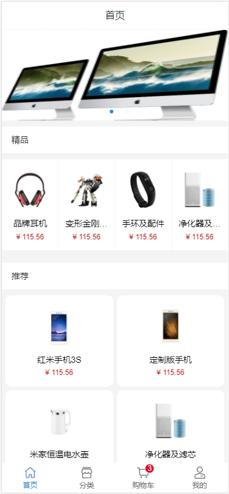
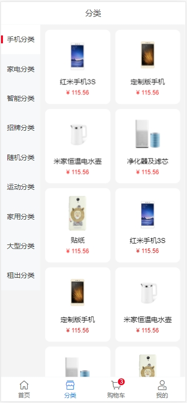
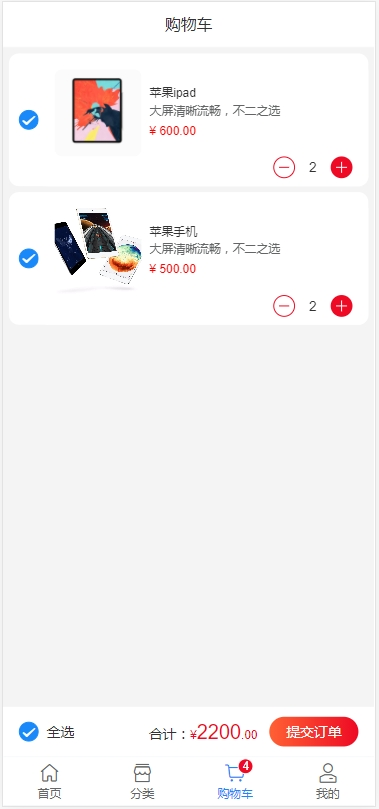
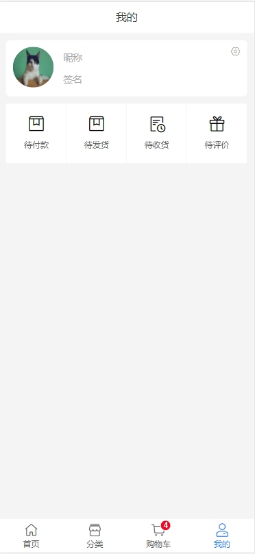
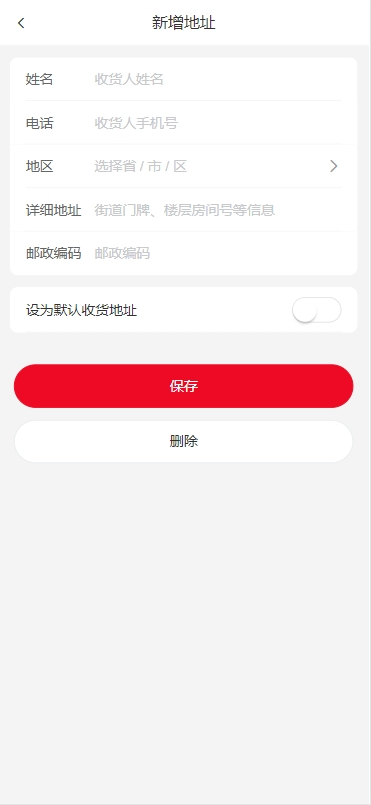

# vue3+vant4

## 项目地址

<a href="https://www.lanlianjiu.xyz/weVueH5#/home" target="_blank">项目演示地址</a>

## 环境版本

```
nuc 16.10.9 (ncu -u)
nvm 1.1.11
node 20.0.0
npm 9.6.4

```

## 项目重要知识点

```html

  1. 采用 vue3 + vite + pinia
  2. 可通过配置路由实现页面缓存效果（路由插件+中央事件总线+keep-alive组件+component组件构成）
  3. 使用 unplugin-auto-import 插件实现自动导入库、方法、函数、自定义等,以$global为前缀作为全局自动导入
  4. 使用 unplugin-vue-components 插件实现自动导入UI库、指定文件下自动全局导入作为组件
  5. 通过模块化配置vite插件，在vite-config/plugins文件夹下配置vite插件

```

## 脚手架

> &ensp;&ensp; master 分支使用 vite + pinia

> &ensp;&ensp; vite 分支使用 vite + vuex

> &ensp;&ensp; vue-cli 分支使用 vue-cli + vuex

## 项目安装

```
npm install 或 cnpm install

```

## 项目启动

```
npm run vite
```

## 项目打包

```
npm run build:dev
npm run build:prod
```

## 项目目录结构

```
|-- src
|    |-- api // api地址
|    |-- assets // 样式以及图片
|    |-- common // 公用模块
|    |   |-- js (以下js内使用插件配置全局导入)
|    |       |-- configure.js // 全局自动导入页面缓存初始化函数
|    |       |-- constant.js // 全局自动导入常量
|    |       |-- eventBus.js // 全局通知实例
|    |       |-- expandRouter.js // 全局自动导入路由处理方法
|    |       |-- http.js // 全局自动导入请求处理函数
|    |       |-- initialize.js // 全局自动导入初始化方法
|    |       |-- locales.js // 全局自动导入国际化方法
|    |       |-- request.js // 全局自动导入请求拦截方法
|    |       |-- router.js // 全局自动导入路由配置
|    |       |-- store.js // 全局自动导入pinia处理函数
|    |-- components // 全局自动注册组件
|    |-- constant // 全局自动注册常量
|    |-- locales // 多语言配置
|    |-- router // 路由模块
|    |-- store // pinia
|    |-- util // 工具类
|    |-- views // 页面
|    |-- App.vue // 入口文件
|    |-- main.js // 入口js文件
|--vite-config  // vite配置
|     |--plugins // vite插件配置
|     |--index.js // vite处理配置
|--vite-env  // vite环境配置
|     |-- .env    // 本地环境配置
|     |-- .env.dev // 测试环境配置
|     |-- .env.prod // 生产环境配置
|     
|-- .eslintrc.js // es配置
|-- babel.config.js // babel配置
|-- vite.config.js // 脚手架配置
```

## 项目全局导入自定义函数、UI 库、自定义组件、自动生成路由

```
（1）安装 unplugin-vue-components 插件用于导入组件库和自定义组件，安装 unplugin-auto-import 用于导入方法、变量等

（2）vite.config.js 配置说明
```

```js
import { defineConfig, loadEnv } from "vite";
import vue from "@vitejs/plugin-vue";
import { baseCfg, pluginCfg } from "./vite-config";
export default async ({ mode }) => {
	const { VITE_BASE_URL } = loadEnv(mode, process.cwd());
	return defineConfig({
		...baseCfg({ VITE_BASE_URL }),
		plugins: [vue(), ...(await pluginCfg({ VITE_BASE_URL }))],
	});
};
```

```
    (3) 对于vite.config.js配置，通过在vite-config/plugins文件夹下建js文件，在index.js会自动加载，在index.js文件内也可配置vite的基本配置
    (4) 对于unplugin-auto-import.js的配置， 针对vue、vue-router、vue-i18n、pinia页面无需使用例如： import { useRouter } from "vue-router";
       可以直接使用 const route = useRouter()
    (5) 对于unplugin-auto-import.js的配置，针对对象内的配置自定义导入的，key为路径，值为数组的形式，
    数组内的名称必须要与路径配置的文件export {}导
       出的名称一致
    (6) 针对unplugin-auto-import.js的自定义配置导出名称建议都以：$global作前缀定义，以说明是通过插件全局自动导入，
    配置则在unplugin-auto-import.js文件内

    (7) 对于unplugin-vue-components.js配置，会读取dirs项数组内的路径加载以extensions项配置的后缀名的文件，
    目前以加载src/components下的所有.vue文件作为组件：
      在文件夹内的index.vue文件时，组件会以文件夹名称作为组件名，例如：components/footer-nav/index.vue 
      组件名为<footer-nav></footer-nav>， 除index.vue以外的文件则以vue文件名作为组件。
    (8) 规范化建议在components文件夹下的组件文件夹以分割号作为间隔命名文件夹名称，文件夹内建一个index.vue文件
    (9) vue文件同名机制是以外层的文件优先作为组件，以文件排在前面的文件优先

```

## 项目路由原理

```
路由大体分为两种：缓存页面、不缓存页面

注意:缓存路由配置只能使用push、replace方式跳转

1.通过路由配置+路由插件+中央事件总线+keep-alive组件+component组件共同构成

2.配置不缓存组件：配置isKeepAlive为fasle或者不配置
```
```js
   {
		path: "/setting",
		name: "setting",
		component: () => import("@/views/common/setting.vue"),
		meta: {},
	},
```
```
3.配置缓存路由：
   （1）只要在src/views/router 内的所有模块js文件内的isKeepAlive设置为true，则页面起缓存效果
```
```js
   {
		path: "/addressList",
		name: "addressList",
		component: () => import("@/views/common/addressList.vue"),
		meta: {
			isKeepAlive: true,
		},
	},
```

```
   （2）在使用页面（缓存页面）的生命周期使用($globalConfigure已插件全局导入可直接使用)
```
```js
onMounted(() => {
	$globalConfigure(() => {
		console.log("缓存页面时--总监听事件接收--用于初始化操作");
	});
});
```

```
   （3）在（2）的$globalConfigure内做当前页面初始化操作

   通过以上四步配置达到效果是：使用push()、replace()方法跳进页面会初始化当前页面，在当前页面再跳入其他页面后,
   再返回当前页面当前页面不会初始化起到缓存效果。例子：A->B->C, B页面缓存，C倒回B不初始化B页面，
   当C倒回B倒回A后再由A-B页面会执行初始化函数$globalConfigure

4.配置无限A页面跳A页面缓存路由：
   （1）只要在src/views/router 内的所有模块js文件内的isKeepAlive、isRouterKeepAlive需要同时设置为true，则页面起缓存效果
```

```js
   {
		path: "/goodsDetail",
		name: "goodsDetail",
		component: () => import("@/views/common/goodsDetail.vue"),
		meta: {
			isKeepAlive: true,
			isRouterKeepAlive: true,
		},
	},
```

```
 （2）使用push()、replace() 在query或parmas上带唯一标识（业务Id或时间戳）
 （3）该配置实现的效果，A页面内有链接，点击跳转还是跳到A页面，但当业务id改变时，跳转后会触发页面初始化函数，在点击回退上一页面时，
      上一页面缓存的是跳转前的页面数据。

6.路由(编程式)传参
  （1）使用query传参
```

```js
        跳转：

            const router = useRouter();
            router.push({
                name: "路由名称",
                query: { 参数 },
            });
```

```js
        接收：

            const router = useRouter();
            const queryParmas =  router?.currentRoute?.value?.query
```

```
    (2) 使用state传参 (用于传较多参数)
```

```js
         跳转：

            const router = useRouter();
            router.push({
                name: "路由名称",
                state: { 参数 },
            });
```

```js
        接收：

            const stateParmas =  history.state
```

## 项目国际化配置

```
src/locales文件夹下：
1.ZH-CN文件夹配置中文json
2.US-EN文件夹配置英文json
3.ZH-CN/common.json、US-EN/common.json 中配置时使用：$t("文件名.json文件内定义的key") 如 $t("common.home")
4. 接口返回的json格式要与本地配置的json格式一致才能起到远程覆盖本地的效果

```

## 项目 pinia 配置

```
1.src/store文件夹下的每个js文件代表一个模块
2.模块命名规则：use+文件名首字母大写（store唯一ID），如：Common.js,处理后模块为useCommon
3.本地起项目，若store中模块store唯一ID存在重复时，调试中会提示报错重复的具体store的ID
4.在Common.js内
export default defineStore("store唯一ID", {
	state: () => ({}),
	getters: {},
	actions: {},
});
```

```
5.页面使用：
（1）const { useCommon } =  $globalStore; // 已用插件导入全局(vue文件内可结构)
 (2) 通过 $globalStore.模块名.(state/getters/actions)的变量或方法进行使用。
```

```js
useCommon.subMsgKey; // 使用state
useCommon.SET_GOODS_NUM(); //调用actions
```

## 项目组件 name 属性设置

```
1.安装vite-plugin-vue-setup-extend插件，在vite.config.js进行插件配置，
在vite-config/plugins下建vite-plugin-vue-setup-extend.js文件
```

```js
import setupExtend from "vite-plugin-vue-setup-extend"; //组件命名插件
const vueSetupExtend = (viteEnv = {}) => {
	return setupExtend();
};

export { vueSetupExtend };
```

```
2.在页面组件内使用：
```

```js
<script setup name="wc-test-global-2">
	onMounted(() => {});
</script>
```

## 项目图片






